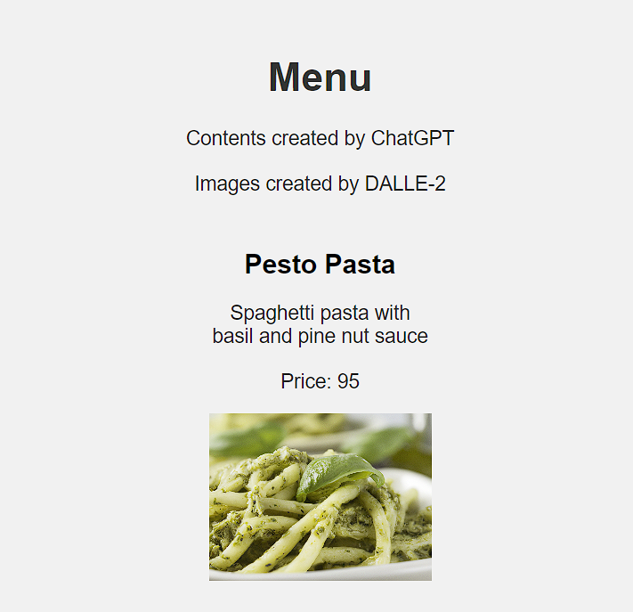

# REST API in DRF
### Test assignment for job interview



## Instalation
Django and DRF needed to run this project. Use the package manager pip to install requirements
```bash
pip install -r requirements.txt
```
## Usage
Frontend is not fully implemented, therefore communication with API needs to be performed with help of 3rd party programs i.e. Postman.  
**Superuser** is set to:

`Login:` admin  
`Password` admin

## API endpoints 


- `admin/`  Admin panel
- `api/menulist/` **GET** all items
- `api/menulist/add` **POST** *(add)* a new item
- `api/menulist/id>` **GET** display item by `id`
- `api/menulist/del/id` **DElETE** item by id
- `api/menulist/update/id` **PUT** */* **PATCH** update item by id
### Both text and image contents of database were created by ChatGPT and DALL-E 2 respectfully